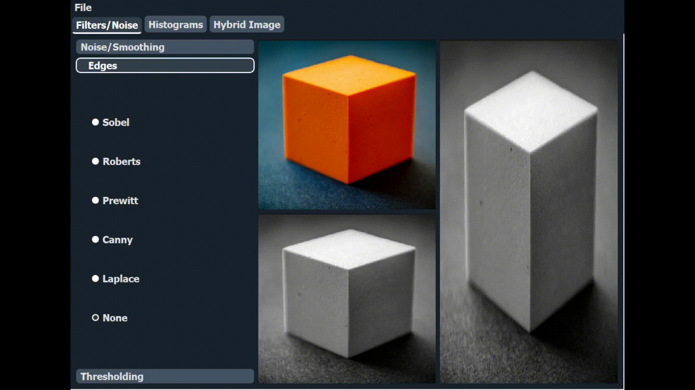
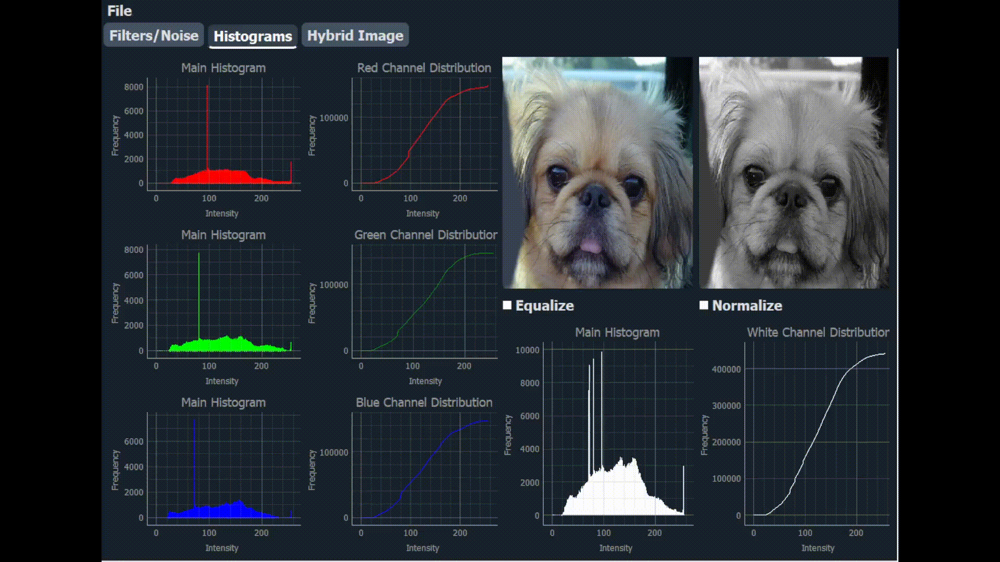

# Imagizer: Image Processing Desktop Application

Imagizer is a desktop application built using PyQt to perform various image processing algorithms. It allows users to manipulate standard images (grayscale and color) with functionalities including noise addition, filtering, edge detection, histogram analysis, normalization, equalization, thresholding, color to grayscale conversion, frequency domain filtering, and hybrid image generation.

## Table of Contents
1. [Installation](#installation)
2. [Usage](#usage)
3. [Features](#features)
4. [Dependencies](#dependencies)
5. [Contributors](#contributors)

## Installation
To install the project, clone the repository and install the requirements:

```bash
# Clone the repository
git clone https://github.com/Zoz-HF/Image_Descriptor
```
```bash
# Navigate to the project directory
cd Image_Descriptor
```
```bash
# Install the required packages:
pip install -r requirements.txt
```
```bash
# Run the application:
python main.py
```

## Usage
To run the application, use the following command:

```bash
python index.py
```

## Features

### 1. Additive Noise
   - Uniform Noise
   - Gaussian Noise
   - Salt and Pepper Noise 


### 2. Filtering
   - Average Filter
   - Gaussian Filter
   - Median Filter

   

### 3. Edge Detection
   - Sobel Operator
   - Roberts Operator
   - Prewitt Operator
   - Laplace Operator
   - Canny Edge Detector

   

### 4. Histogram Analysis
   - Histogram Plotting
   - Distribution Curve Plotting


### 5. Equalization

### 6. Normalization

   


### 7. Thresholding
   - Local Thresholding
   - Global Thresholding

   

### 8. Color to Grayscale Conversion
   - Plotting R, G, and B histograms
   - Distribution Function Plotting

### 9. Frequency Domain Filtering
   - High Pass Filters
   - Low Pass Filters

### 10. Hybrid Images

   


## Dependencies
This project requires the following Python packages listed in the `requirements.txt` file:
- PyQt5
- opencv
- numpy
- scipy 

## Contributors

- [Ziyad El Fayoumy](https://github.com/Zoz-HF)
- [Assem Hussein](https://github.com/RushingBlast)
- [Mohamed Sayed Diab](https://github.com/MohamedSayedDiab)
- [Abdel Rahman Shawky](https://github.com/AbdulrahmanGhitani)
- [Omar Shaban](https://github.com/omarshaban02)
